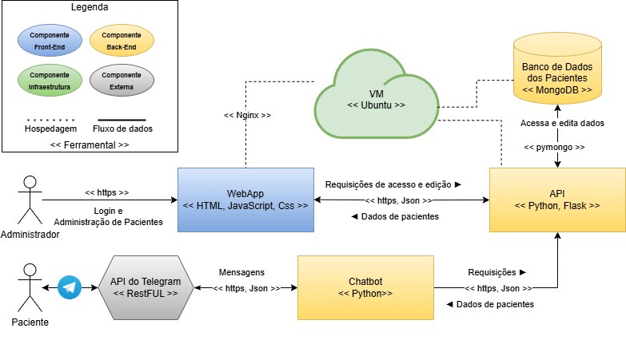

# Arquitetura do Sistema

O sistema desenvolvido para este TCC é composto por quatro componentes que podem ser implantadas separadamente em qualquer servidor na nuvem:

1. Banco de dados não relacional (No-SQL): simula uma base de dados de pacientes e exames para testar a solução computacional proposta neste TCC. 
   * Implantado com o MongoDb.
   * Documentação da estrutura: [database.md](database.md)
2. WebApp: provê uma maneira de registrar, visualizar e editar o conteúdo do banco de dados, evitando intervenção manual no próprio ambiente e facilitando o processo de cadastramento dessas informações.
   * Possui um esquema de autenticação simples.
   * Implementado com HTML, CSS e Javascript.
3. API: uma interface básica com autenticação simples e comandos para agir no banco de dados. Foi construída para evitar a exposição da base de dados sensível na rede e para simular o fluxo de execução que seria realmente usado em um sistema na prática. 
    * O WebApp e o Chatbot usam esta interface para realizar qualquer operação no banco de dados, cada um com seu próprio usuário isolado para autenticar.
    * Implementado com Python e framework Flask.
    * Documentação da estrutura: [api.md](api.md)
4. Chatbot: principal componente deste sistema. Simula a solução proposta neste TCC de forma didática e com funcionalidades minimalísticas usando a API do Telegram para enviar mensagens para os pacientes cadastrados.
    * Implementado com Python
    * Documentação das funcionalidade: [chatbot.md](chatbot.md)

O diagrama abaixo mostra o fluxo das informações dentro do sistema e relaciona as tecnologias usadas para implementar e ligar todos os componentes. 

  
   
  Diagrama da Arquitetura deste projeto.

A arquitetura implementada, ao separar claramente cada responsabilidade em módulos independentes (WebApp, API, banco de dados e Chatbot), facilita a manutenção, pois eventuais ajustes ou melhorias podem ser realizados em um componente sem impactar diretamente os demais. Do ponto de vista da segurança, a arquitetura minimiza a exposição do banco de dados sensível, já que o acesso ocorre exclusivamente por meio da API, que possui um esquema simples de autenticação assim como o WebApp. Em conjunto com a escolha de usar o protocolo HTTPS para a comunicação na implantação na nuvem, torna o sistema adequadamente seguro mesmo sendo uma solução computacional relativamente simples para fins didáticos e de demonstração.

Sem entrar em detalhes completos sobre a implementação de cada componente, as seções abaixo justificam a escolha de cada uma dessas tecnologias e as alternativas consideradas.

## Tecnologias Gerais

* Protocolo de comunicação entre usuários e componentes: https. Alternativa considerada: http.
  
Embora HTTP ser usado no ambiente de desenvolvimento local por simplicidade, o sistema implantado  adota o HTTPS, que é a alternativa mais segura. Isso garante confidencialidade e integridade dos dados trafegados, além de ser requisito para conformidade com boas práticas de segurança e compatibilidade com navegadores modernos.

* Linguagem de marcação para estruturar as mensagens entre as componentes deste sistema: Json. Alternativa considerada: nenhuma.

Json é utilizado para estruturar as mensagens devido ao fato de ser padrão amplamente adotado em APIs REST, oferecendo estrutura leve, legibilidade e integração fácil com as demais tecnologias selecionadas neste projeto.

## WebApp

* Conjunto de ferramentas usadas: HTML, CSS e Javascript. Alternativa considerada: ReactJS.
  
Todas as ferramentas consideradas são amplamente utilizadas no mercado brasileiro, possuem vasta documentação e demonstram maturidade técnica adquirida ao longo de várias versões, estando consolidadas no tempo. O ReactJS é uma ferramenta flexível e rica em recursos para construção de interfaces, sendo mais adequada para aplicações complexas e escaláveis comparado com o uso do HTML, CSS e JavaScript. No entanto, o conjunto de ferramentas escolhido é mais simples, viabilizando um desenvolvimento mais rápido. Dada a baixa complexidade do sistema proposto neste TCC, essa escolha é mais apropriada para um sistema pequeno com fins demonstrativos.

* Plataforma para hospedagem na máquina virtual: Nginx. Alternativa considerada: nenhuma.

A plataforma utilizada para hospedagem na máquina virtual foi o Nginx. Nenhuma alternativa foi considerada, dado que o Nginx atende aos requisitos do projeto.

## API

* Linguagem de programação: Python. Alternativas consideradas: JavaScript (Node.js) e PHP.

A linguagem de programação utilizada no desenvolvimento da API back-end foi Python devido à sua ampla utilização no mercado brasileiro, maturidade técnica e disponibilidade de frameworks. Em comparação com PHP, Python é mais moderno, modular e simples. Em relação ao Node.js, embora Python apresente desempenho inferior neste tipo de aplicação, sua curva de aprendizado é menor. Para um sistema de baixa complexidade, como a deste TCC, a vantagem de acelerar consideravelmente o desenvolvimento supera as limitações de desempenho e tornam Python uma escolha mais adequada.

* Framework para implementação da interface: Flask. Alternativas consideradas: FastAPI e Django.

Flask foi escolhido por sua leveza, simplicidade e flexibilidade, permitindo uma estrutura enxuta e de fácil controle, ideal para APIs de baixa complexidade como a deste TCC. Em comparação, o Django oferece uma estrutura mais robusta, porém com sobrecarga desnecessária para os objetivos do projeto. Já o FastAPI possui melhor desempenho e suporte nativo a tipagem e documentação automática, mas introduz uma curva de aprendizado adicional. Dada a familiaridade prévia com Flask e o escopo limitado da aplicação, essa escolha se mostrou mais adequada.

## Banco de Dados

* Estrutura não relacional (NoSQL) versus relacional (SQL); Decisão: usar NoSQL.

A decisão pela utilização de NoSQL em vez de um banco de dados relacional SQL baseia-se no fato de que o sistema deste projeto de TCC é relativamente simples e serve somente para fins demonstrativos. Apesar do SQL ser mais adequado devido a complexidade da base de dados de qualquer prefeitura ou sistema que pode implementar a solução proposta neste TCC, o projeto arquitetado para demonstrar a solução proposta somente usa uma quantidade pequena de dados com relação simples entre paciente e exame. Dessa forma, a escolha de utilizar NoSQL é mais adequada para acelerar o desenvolvimento. 

* Ferramenta para implementar o banco de dados: MongoDb. Alternativa considerada: nenhuma.

O MongoDB foi escolhido para implementação do banco de dados por ser uma solução NoSQL amplamente adotada no mercado brasileiro e de fácil entendimento. Sua ampla documentação, comunidade ativa e integração nativa com linguagens como Python suavizaram a curva de aprendizado do uso desta ferramenta. Pareado com o fato de que o MongoDb atende plenamente os requisitos do sistema deste projeto, nenhuma outra alternativa foi considerada.

## Chatbot

* Linguagem de programação: Python. Alternativas consideradas: JavaScript (Node.js).

O Python foi escolhido pelos mesmos motivos práticos descritos para justificar a escolha desta linguagem de programação para a API. Dado a maturidade e facilidade de uso da biblioteca `python-telegram-bot` que, em comparação a alternativa para o Node.js, oferece uma curva de aprendizado menor. Diante disso, Python se mostrou a opção mais prática e adequada ao escopo do Chatbot implementado neste TCC.